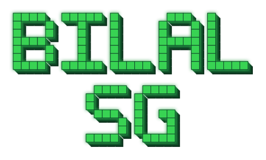

<div align="center">



<br/>



<br/>


[](https://www.linkedin.com/in/bilal-segaa%F0%9F%8D%80-60b566306/)
[](mailto:b_segaa@estin.dz)

</div>

<br/>

```bash
bilal@estin:~$ cat about.md
```

<table>
<tr>
<td width="55%" valign="middle">

> CS Engineer specializing in **Artificial Intelligence & Data Science**
> (ESTIN). I turn messy data into products people can actually use, from ML
> pipelines to the full-stack apps that ship them.
>
> On the data side: clustering, predictive modeling, statistical inference
> over behavioral traces. On the AI side: NLP pipelines, semantic retrieval,
> applied deep learning with PyTorch & Keras. On the engineering side:
> React, Vue, Angular, Laravel and Django, building and shipping the
> interfaces and APIs around the models.
>
> Currently drawn to **intelligent tutoring systems**, **learning
> analytics**, and **AI-driven personalization**: teaching machines to
> understand not just data, but people.

</td>
<td width="45%" align="center" valign="middle">

</td>
</tr>
</table>

<br/>

```bash
bilal@estin:~$ ls -la stack/
```

<div align="center">

| `data_science/` | `ai_ml/` | `frontend/` | `backend/` | `infra/` |
|:---:|:---:|:---:|:---:|:---:|
|  |  |  |  |  |
|  |  |  |  |  |
|  |  |  |  |  |
|  |  |  |  |  |

</div>

<br/>

```bash
bilal@estin:~$ ps aux | grep coding
```

<div align="center">


<sub><code>bilal@estin:~$ status: probably debugging something at 2am 🐾</code></sub>

</div>

<br/>

```bash
bilal@estin:~$ ls -la projects/ | tee saved.log
```

<div align="center">


<sub><code>-rw-r--r--  saved to disk, 4 entries</code></sub>

</div>

<table width="100%">
<tr>
<td width="8%" align="center">💾</td>
<td width="92%">

**`UI Fusion`**: a curated gallery of standout UI/UX design references.
<br/><sub>Full-stack build, live and shipped: **[uifusion.vercel.app](https://uifusion.vercel.app)**</sub>

</td>
</tr>
<tr>
<td align="center">💾</td>
<td>

**`Facial Emotion Recognition API`**: a CNN trained in PyTorch for facial expression classification, wrapped and deployed as a REST API.

</td>
</tr>
<tr>
<td align="center">💾</td>
<td>

**`Word-Level Text Generator`**: a word-level LSTM built in Keras for controllable text generation, with temperature-tuned sampling.

</td>
</tr>
<tr>
<td align="center">💾</td>
<td>

**`Argument Quality Classifier`**: Sentence-Transformer embeddings feeding gradient-boosted and random-forest classifiers, scoring argument quality in French media texts.

</td>
</tr>
</table>

<br/>

```bash
bilal@estin:~$ git log --graph --oneline --all
```

<div align="center">
<picture>
  <source media="(prefers-color-scheme: dark)" srcset="https://raw.githubusercontent.com/bilalsg/bilalsg/output/github-contribution-grid-snake-dark.svg" />
  
</picture>
</div>

<br/>

```bash
bilal@estin:~$ ./contact.sh --reach-out
```

<div align="center">

[](https://www.linkedin.com/in/bilal-segaa%F0%9F%8D%80-60b566306/)
[](mailto:b_segaa@estin.dz)

<sub>`exit 0`, open to collaboration in data science & full-stack dev 🌱</sub>

</div>
